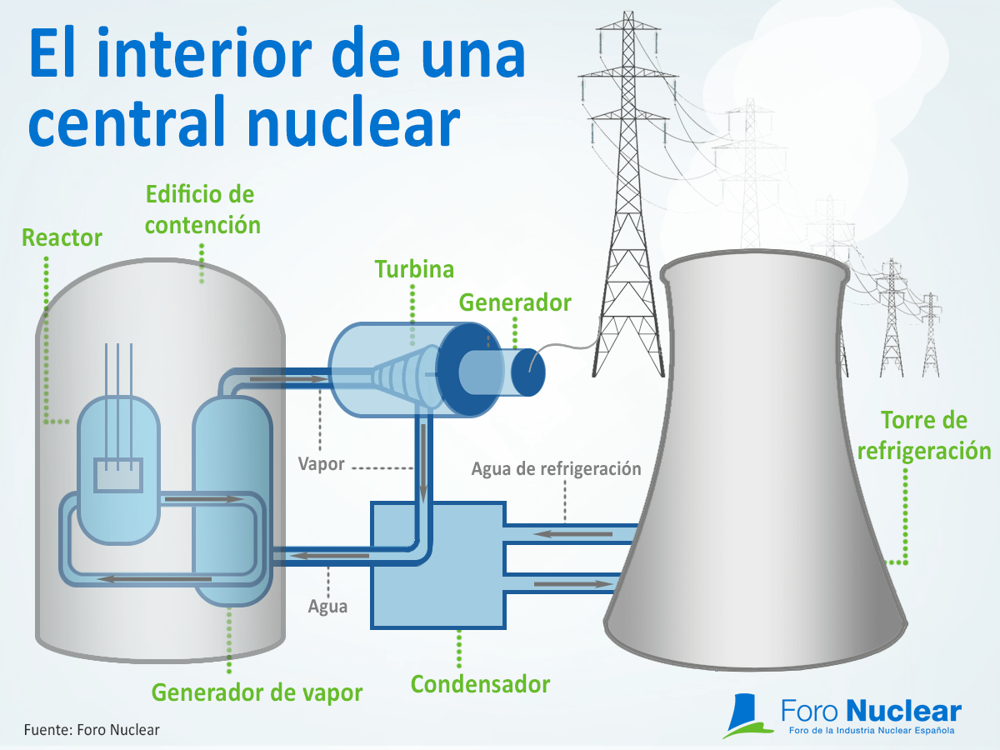

## Introducción

El Sr. Montgomery B. desea implementar un sistema que asista a los operadores de su planta nuclear, en particular a un tal
Homero J. S., en su operatoria diaria.
En un relevamiento realizado, el Sr. Montgomery B. nos explica que una central nuclear es una instalación industrial en la que
se genera electricidad a partir de la energía nuclear que se libera en forma de energía térmica mediante una reacción nuclear
de fisión en cadena en la vasija de un reactor nuclear.
El componente principal de una central es el reactor nuclear, en el que se aloja el combustible nuclear (habitualmente uranio) y
que cuenta con sistemas que permiten iniciar, mantener y detener, de forma controlada, la reacción nuclear.
La energía térmica liberada (MWTh) se utiliza para calentar agua hasta convertirla en vapor. Este vapor hace girar una turbina
que está conectada a un generador, que transforma la energía mecánica del giro de la turbina en energía eléctrica (MWe).
A continuación una imagen sobre la planta nuclear y sus componentes:

El Sr. Montgomery B. nos comenta que su planta cuenta con mecanismos de control que le permiten evitar accidentes con el
reactor. Uno de estos mecanismos se basa en utilizar sensores que informan la temperatura del reactor en todo momento. Otro
de estos mecanismos consiste en utilizar barras de control. Las barras de control, son elementos fabricados con material que
absorbe los neutrones, y se insertan o retiran del núcleo del reactor para controlar la velocidad de reacción nuclear o para
detenerla. Existe un tercer mecanismo de control, aún no implementado, que consiste en utilizar turbinas de refrigeración. Estas
turbinas se encargan de impulsar el material refrigerante (agua) a través del reactor para de esa forma disminuir el calor
generado en el interior del mismo.

## Funcionamiento del reactor

El reactor del Sr. Montgomery B., posee una capacidad de 700 MW/h, lo que significa que en condiciones normales, puede
generar hasta 700 MWe de energía eléctrica por hora, aunque por lo general, la cantidad por hora producida es menor.
En base a la temperatura registrada, el reactor se comporta de diferentes maneras.
Su rango normal de temperatura, es decir, cuando se encuentra funcionando en un estado de normalidad, se encuentra entre
[280, 330]°C
A partir de los 330°C se pasa a un estado de criticidad en el cual la capacidad productiva del reactor se ve disminuida en un
80% de su capacidad total.
A partir de los 400°C se determina que la situación es crítica y el reactor, pero no la planta nuclear, debe ser apagado de forma
inmediata para evitar accidentes. El reactor no puede generar energía hasta que la temperatura alcance el rango de normalidad
otra vez.
Cuando el reactor está trabajando en condiciones normales, la producción de energía responde a la siguiente tabla:

|Temperatura [°C]| Energia Termal [MWTh]| Energia Neta [MWe]|
|-|-|-|
|280.00| 2100.0 |100.00|
|288.33| 2166.67| 116.65|
|296.66| 2233.34| 233.32|
|304.99| 2300.01| 349.99|
|313.32| 2366.68| 466.66|
|321.65| 2433.35| 583.33|
|329.98| 2500.02| 700.00|

El Sr. Montgomery B. nos pide que el sistema envíe una alerta a Homero J. S. en caso de que la temperatura del reactor
supere los 330 °C, de manera tal que Homero pueda activar los protocolos de enfriamiento del reactor. Este mecanismo, que
sólo puede ser activado en caso de que la temperatura supere los 330 °C, reduce la potencia generada en base al consumo
automático de barras de control que posee el reactor.
Cada barra de control permite reducir la energía térmica liberada en un determinado porcentaje. Este porcentaje, que depende
del tiempo de vida útil restante de cada barra, responde a la siguiente fórmula:
prc = (tiempo_vida_util / 3600) * 100
donde tiempo_vida_util es un valor que varía entre 0 y 200.
Otro de los requerimientos es que el mecanismo de enfriamiento no pueda ser activado si el reactor funciona con normalidad.

## ¿Qué se pide?

1. Diagrama de clase de la solución propuesta.
2. Diagramas de sequencia de 2 o más requerimientos a definir por el equipo.
3. Desarrollar una aplicación que permita emular la situación planteada. Proveer el código y las pruebas unitarias para
verificar:
    1. Cantidad de energía neta producida en una determinada cantidad de horas. Considerar distintos escenarios.
    2. Cantidad de barras de control consumidas para normalizar el estado del reactor. Considerar distintos escenarios.
    3. Enviar una notifiación a Homero J. S.
    4. Verificar que los mecanismos de generación de energía y enfriamiento se activen bajo las condiciones especificadas.
    5. Conocer la temperatura del reactor en todo momento.
    6. Conocer la cantidad de energia neta (MWe) producida en todo momento.

#### Requerimientos adicionales:
Desarrollar las pruebas unitarias para cada método realizado.
El porcentaje de código cubierto por pruebas unitarias debe superar el 80%.
Agregar archivo README.md al proyecto describiendo el proyecto, agregar instrucciones para su compilación y
funcionamiento.