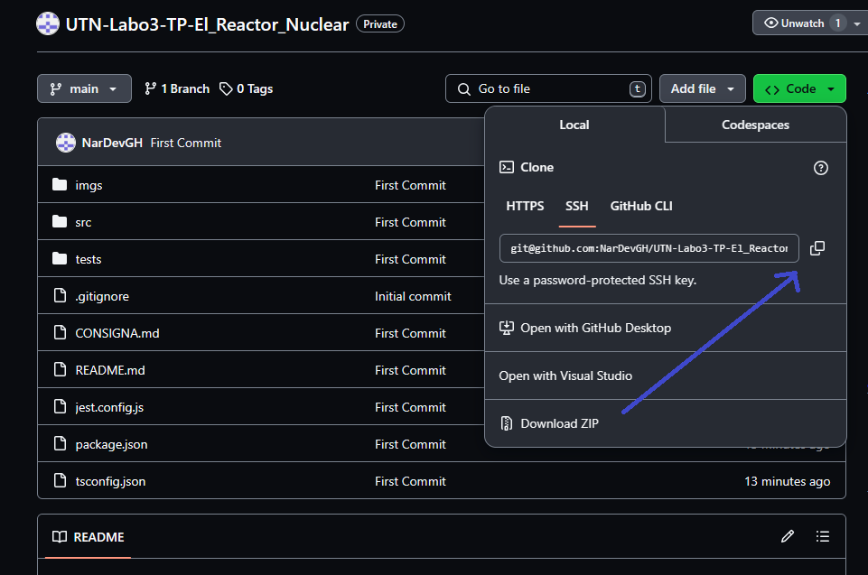
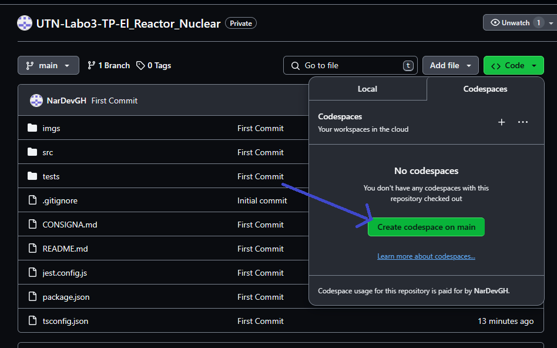

# ☢️ Trabajo Práctico - El Reactor Nuclear ☢️


### Consigna: [LINK](./CONSIGNA.md)

## PARTICIPANTES:
- Fredes Matias
- Cobuzzi Macarena
- Correa Bahia
- Mateo	Bautista


## PACKAGES:
- Jest
- TypeScript

## COMO EJECUTAR PROYECTO:
1. Clona el proyecto en una carpeta de tu PC o Crear un Codespace.
    1. Clonar Proyecto:
    
    2. Crear Codespace:
    
2. Desde una terminal que este posicionado en el directorio del proyecto, ejecutar el siguiente comando para instalar los paquetes:
```bash
npm i
```
3. Una vez haya finalizado de instalar todos los paquetes, ejecutar el siguiente commando para iniciar el programa:
```bash
npm run start:dev
```
Para ejecutar las pruebas unitarias y asegurarte de que el sistema funciona correctamente, ejecuta npm test. Esto correrá todas las pruebas definidas en el proyecto utilizando Jest.

## DESCRIPCIÓN DEL PROYECTO:

patrones de diseño, observer, facade y state, ademas de los principios solid, en en siguiente proyecto: 

El proyecto consta de un reactor nuclear el cual cuenta con los siguientes objetos:
### Reactor: 
Es el nucleo de nuestra central nuclear. El mismo se encarga de centralizar el funcionamiento general de la planta. En este podemos encontrar la **temperatura actual**, la cual generará energía. Ademas dependiendo de su variación, el reactor pasará por diferentes estados: el **Estado Normal**, **Estado Criticidad** y **Estado Crítico**. El reactor será observado por **Operarios** o **Directivos** dependiendo su Estado. Utilizaremos **contadores de barras** para contabilizar las **Barras de Control** que refrigeraran el reactor en base al Estado correspondiente. Por otro lado usaremos otros **contadores de estados** que se encargaran de reflejar la cantidad de veces que se realizó un cambio a cada estado. 
Por otro lado usaremos Facade para centralizar los métodos fundamentales del reactor: 
    - generarEnergia() : se encargará de devolver la energía termal y neta que producirá el reactor en base a la temperatura ingresada
    - energiaGeneradaEnXHoras() : se encargará de devolver la energía termal y neta en una determinada cantidad de horas basandose en la temperatura
    - enfriar() : se encargará de iniciar los metodos de reducción de temperatura en caso de ser necesario, esto ocurre cuando nos encontramos en un Estado Criticidad y Estado Critico 

### Estados: 
En esta sección del proyecto desarrollaremos los métodos de cada posible estado, los cuales compartirán métodos que actuaran en base a las responsabilidad de cada estado: 
- Estado Normal: Este estado tomará protagonismo cuando la temperatura del reactor se encuentre entre 280 y 330. En este rango de temperatura se desarrollan los siguientes métodos: 
    - manejoCambioTemperatura() : en este estado, el método delegará la responsabilidad al estado que corresponda en base a la temperatura ingresada y elevará el contador del estado que vaya a tomar protagonismo.
    - calcularEnergia() : método de calculo lineal que retornará un valor de energiaTermal y energiaNeta en base a la temperatura ingresada
    - generarEnergia() : método que modificará la salida de calcularEnergia(), el cual es un método de calculo lineal. La tarea de generarEnergia() es servir de ajuste de los valores obtenidos, haciendolo variar en base al estado protagonista, en este estado mantendrá su valor original
     - energiaGeneradaEnXHoras() : método que mediante una determinada cantidad de horas y temperatura retornará la energia neta generada.
- Estado Criticidad: Este estado tomará protagonismo cuando la temperatura del reactor se encuentre superando los 330 pero manteniendose por debajo de 400. En este rango de temperatura, se establecerá un nuevo método y de los métodos mencionados anteriormente se sobreescribiran unos de la siguiente forma: 
        - manejoCambioTemperatura() : en este estado, el método actuará de 2 posibles maneras. En el primer caso la temperatura establecida supera el margen que maneja este estado y procederá a delegar la responsabilida al Estado Crítico y elevará el contador de dicho estado. En el segundo caso, utilizará las Barras de Control para reducir la capacidad productiva del reactor en un 80% y retornando la responsabilidad al Estado Normal, junto a lo que elevará su contador de intervención
    - generarEnergia() : En este estado, el método modificará el resultado de calcularEnergia(), devolviendo el 20% de la energía, correspondiendo a la reducción realizada en manejoCambioTemperatura()
     - notificarOperarios() : Este método se encargará de enviar una **Alerta** a los operarios, una vez que este la temperatura del reactor supere los 330 grados.
- Estado Critico: Este estado tomará protagonismo cuando la temperatura del reactor se encuentre por encima de los 400 grados. En este rango de temperatura, se establecerá un nuevo método y de los métodos mencionados anteriormente se sobreescribiran unos de la siguiente forma:
    - manejoCambioTemperatura() : en este estado, el método baja la temperatura, usando las barras de control, hasta que la temperatura sea menor a 330, de esta manera, pasando a Estado Normal.
    - generarEnergia() : En este estado, el método modificará el resultado de calcularEnergia(), devolviendo 0, ya que en este estado no se genera energía.
    - notificarDirectivos() : Este método se encargará de enviar una **Alerta** a los directivos, una vez que el reactor se encuentre apagado.
### Observadores: 
en esta sección se encotrará la estructura de nuestros observadores operarios y directivos, los cuales poseeran los siguientes métodos: 
    - recibirAlerta() : este método se encarga de recibir la Alerta generada mediante las notificaciones de los estados y las almacenará en un array **alertasRecibidas**
    - getAlertas() : este método permitirá visualizar las Alertas almacenadas
    - Sensor: esta seccion se basa en un sensor de temperatura que controlará al reactor y permitirá obtener su temperatura actual en todo momento
### Barras:
en esta sección se encuentra la estructura básica de las **Barras de Control**, las cuales poseeran el tiempo de vida útil. Este determinará cuanto uso le queda a cada barra que utilizaremos y cual será su rendimiento en la refrigeración del reactor
### Alerta: 
en esta sección se encuentra la estructura básica de las **Alertas** generadas por los estados y obtenidas por los observadores. Las mismas contaran con una variable que almacenará la temperatura al momento de su emisión y un mensaje que brindará información sobre el proceso en que se encuentra el reactor / acción a realizar.

## Principios SOLID y patrones de diseño utilizados

En el código podemos identificar tanto principios SOLID aplicados como patrones de diseño, y los mismos se encuentran distribuidos de la siguiente manera:

- ***Reactor***: En esta clase se pueden identificar:
    - **Single Responsibility Principle (SRP):** La clase Reactor se encarga principalmente de manejar la temperatura, generar energía y gestionar sus observadores. 
    - **Open/Closed Principle (OCP):** La clase Reactor es abierta para extensión pero cerrada para modificación, especialmente porque usa la abstracción Estado para manejar diferentes comportamientos de estado.
    - **Interface Segregation Principle (ISP):** Utiliza la interfaz EmiteTemperatura para definir métodos específicos de temperatura, asegurando que Reactor solo implementa lo necesario.
    - **Observer Pattern:** El código implementa el patrón Observador mediante listas de observadores _observadorOperario y _observadorDirectivo, permitiendo que múltiples objetos se suscriban a cambios en el estado del reactor.
- ***Alerta***: en esta clase se puede identificar:
    - **Single Responsibility Principle (SRP)**: La clase que se puede deducir de este archivo se encarga solo de manejar mensajes y temperatura de alerta.
- ***Estados***: en esta clase se pueden identificar:
    - **Single Responsibility Principle (SRP)**: La clase Estado tiene una única responsabilidad relacionada con el cálculo de energía y el manejo de cambios de temperatura.
    - **Open/Closed Principle (OCP)**: Estado es una clase abstracta, lo que permite la extensión a través de subclases concretas (EstadoNormal, EstadoCriticidad, etc.) sin modificar la clase base.
    - **State Pattern:** Estado y sus subclases (EstadoNormal, Estado Criticidad, Estado Critico) implementan el patrón State, permitiendo que el comportamiento del reactor cambie cuando su estado cambia.

### Beneficios:

- Mantenibilidad: Separar las responsabilidades mediante SRP hace que el código sea más fácil de entender y mantener.
- Extensibilidad: Hacer uso de OCP permite agregar nuevas funcionalidades sin modificar el código existente, reduciendo el riesgo de introducir errores.
- Reusabilidad: Las interfaces y clases abstractas permiten la reutilización de código en diferentes contextos.
- Flexibilidad: Los patrones de diseño como el Observer y el State proporcionan flexibilidad al sistema, permitiendo que los objetos se comporten de manera diferente según su estado interno y permitiendo notificaciones eficientes entre objetos.